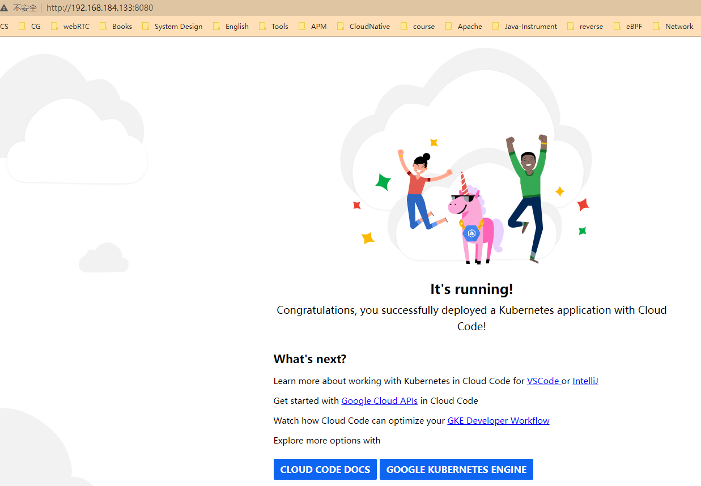
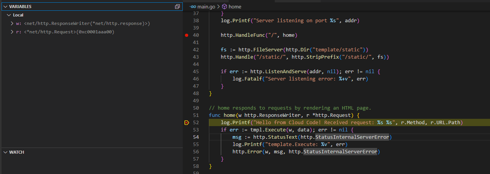

# Google Cloud Code 101

## Overview

Official website: https://cloud.google.com/code


## Prepare

- vscode install Google Cloud Code extension
- clone samples
  - https://github.com/GoogleCloudPlatform/cloud-code-samples.git

- open  `cloud-code-samples/golang/go-hello-world` folder with vscode

## Magic *pass* *through* GFW

### Dockerfile modify

```dockerfile
# FROM golang:1.19 as build
FROM docker.nju.edu.cn/golang:1.19 as build

# FROM gcr.io/distroless/base
FROM gcr.nju.edu.cn/distroless/base
```

### debug-helpers-registry

```shell
# default: gcr.io/k8s-skaffold/skaffold-debug-support
skaffold config set --global debug-helpers-registry gcr.nju.edu.cn/k8s-skaffold/skaffold-debug-support
```


## Run

In vscode, click `Cloud Code` -->  `Run on Kubernetes` 


```shell
# kubectl get all
NAME                                  READY   STATUS    RESTARTS   AGE
pod/go-hello-world-7d6f8999d9-xcwkw   1/1     Running   0          4m24s

NAME                              TYPE           CLUSTER-IP      EXTERNAL-IP   PORT(S)        AGE
service/go-hello-world-external   LoadBalancer   10.96.122.235   <pending>     80:31795/TCP   4m24s
service/kubernetes                ClusterIP      10.96.0.1       <none>        443/TCP        3h35m

NAME                             READY   UP-TO-DATE   AVAILABLE   AGE
deployment.apps/go-hello-world   1/1     1            1           4m24s

NAME                                        DESIRED   CURRENT   READY   AGE
replicaset.apps/go-hello-world-7d6f8999d9   1         1         1       4m24s

# kubectl port-forward --address 0.0.0.0 service/go-hello-world-external 8080:80
Forwarding from 0.0.0.0:8080 -> 8080
```


```shell
# STEAM Application Logs [server]2023/04/12 06:31:52 Server listening on port :8080
[server]2023/04/12 06:44:04 Hello from Cloud Code! Received request: GET /
[server]2023/04/12 06:46:19 Hello from Cloud Code! Received request: GET /
```


```shell
# open 127.0.0.1:8080
```




## Debug

In vscode, click `Cloud Code` -->  `Debug on Kubernetes` 




## References

- https://cloud.google.com/code/docs/vscode/k8s-overview

- https://skaffold.dev/
- https://oracle.github.io/learning-library/developer-library/cloud-native/oke-with-service-broker/workshops/oke-live-devops/freetier/?lab=skaffold-debug#Introduction
