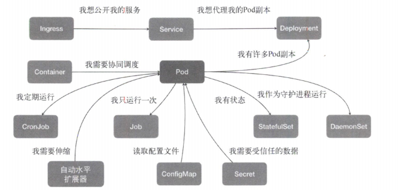

### 任务之间的关系

- 紧密协作关系 Pod
  - 互相之间会发生直接的文件交换
  - 使用localhost或者Socket文件进行本地通信
  - 会发生非常频繁的远程调用
  - 需要共享某些Linux Namespace(如Network, Volume)
- 集群内访问关系 Service
- 集群外访问关系 Ingress

## Pod

Pod: 一组共享了某些资源的容器

- 共享一个 Network Namespace
  - Infra 容器 创建Network
    - k8s.gcr.io/pause
    - CNI 插件只需要负责处理 Infra container的网络配置，无需关心其他容器
  - 其他的容器 加入 Network
  - Init Container 在用户Container启动之前启动(多个Init按顺序依次启动)
    - Istio sidecar
    - tomcat war
- 可以声明共享一个Volumn

**可以把Pod类比成一台虚拟机，容器就是虚拟机上的一个进程。**

### Projected Volume

- ConfigMap
- Secret
- ServiceAccountToken
- Downward API

