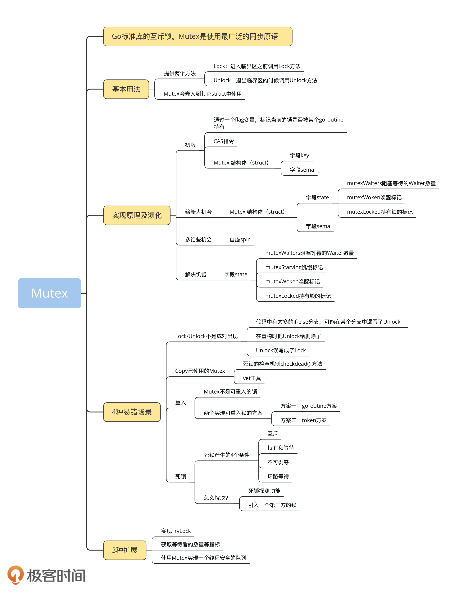
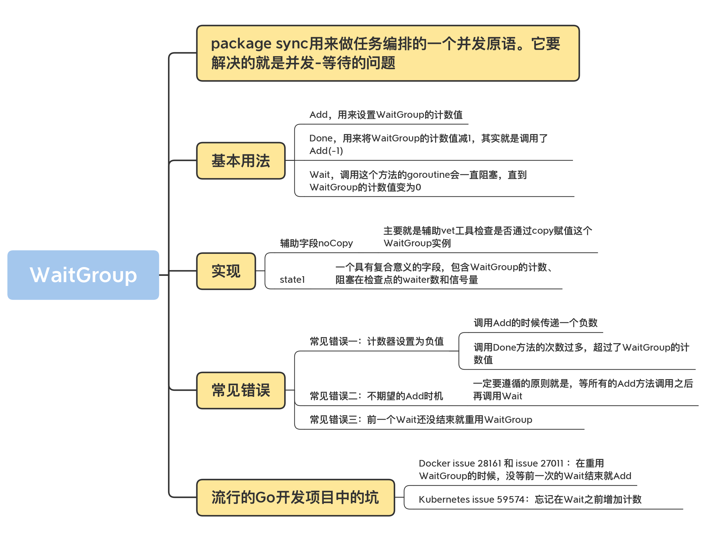
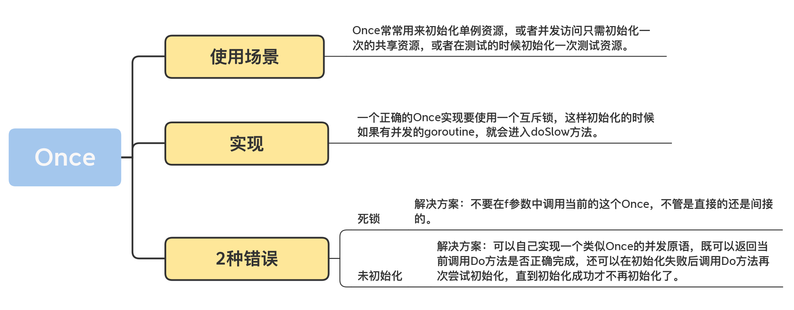
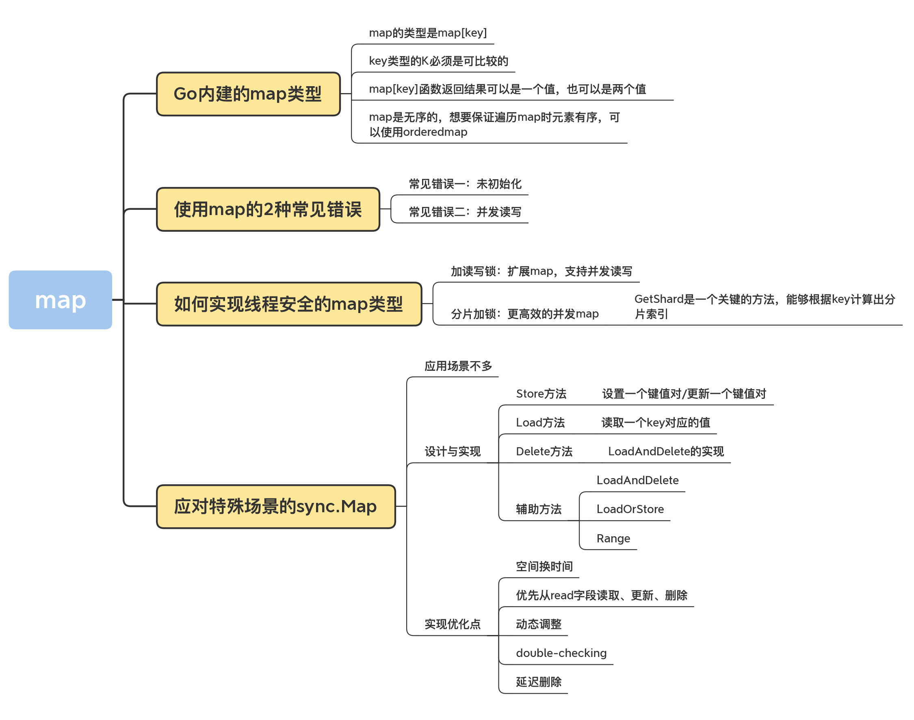
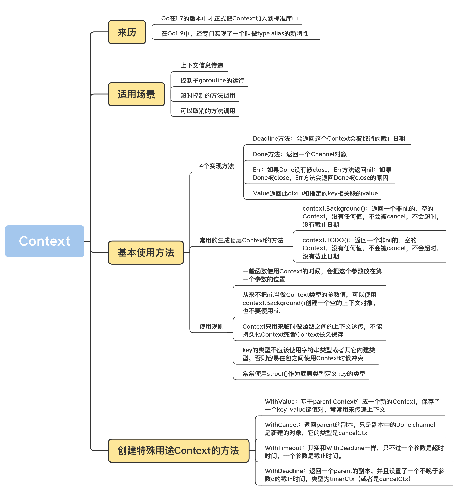
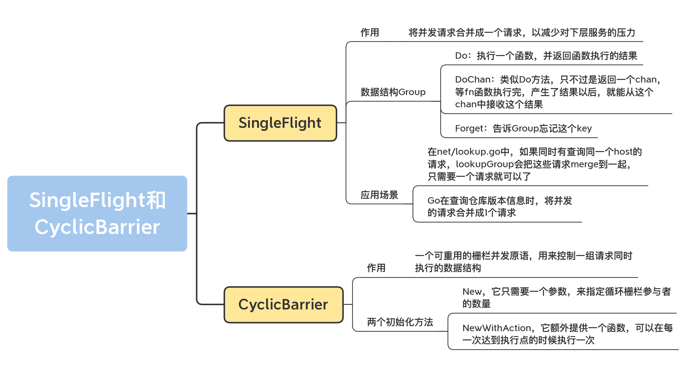

## Overview

### mutex

## WaitGroup

### Once

### map

### Context

### SingleFlight&CyclicBarrier

## References

- mutex
  - https://songlh.github.io/paper/go-study.pdf
- map
  - https://github.com/orcaman/concurrent-map
- pool
  - https://github.com/gohugoio/hugo/blob/master/bufferpool/bufpool.go
  - https://github.com/vitessio/vitess/blob/main/go/bucketpool/bucketpool.go
- atomic
  - https://github.com/uber-go/atomic

- SingleFlight
  - [groupcache](https://github.com/golang/groupcache.git)

- CyclicBarrier
  - 

- Other
  - [type alias](https://yourbasic.org/golang/type-alias/)

