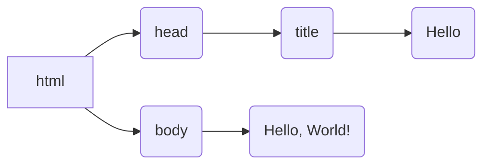

# HTML & CSS

## HTML

### Document Object Model

```html
<!DOCTYPE html>
<html lang="en">
    <head>
        <title>Hello</title>
    </head>
    <body>
        Hello, World!
    </body>
</html>
```




### Elements

#### Head

```html
        <h1>Head1</h1>
        <h2>Head2</h2>
        <h6>Head6</h6>
```


#### Lists

```html
        Ordered List: 
        <ol>
            <li>Item1</li>
            <li>Item2</li>
            <li>Item3</li>
        </ol>

        Unordered List:
        <ul>
            <li>Item1</li>
            <li>Item2</li>
            <li>Item3</li>
        </ul>
```


#### image

```html

```


#### link

```html
<a href="https://google.com"> Google </a>
<a href="image.html"> Bob </a>
```


#### table

```html
    <table>
        <thead>
            <tr>
                <th>Ocean</th>
                <th>AvgDepth</th>
                <th>MaxDepth</th>
            </tr>
        </thead>
        <tbody>
            <tr>
                <td>Pacific Ocean</td>
                <td>4,280 m</td>
                <td>10,911 m</td>
            </tr>
            <tr>
                <td>Atlantic Ocean</td>
                <td>3,646 m</td>
                <td>8,486 m</td>
            </tr>
        </tbody>
    </table>
```


#### form

```html
        <form>
            <div>
                <input type="text" name="name" placeholder="Name">
                <input type="password" name="password" placeholder="Password">
            </div>

            <div>
                Favorite color?
                <input type="radio" name="color" value="red" > Red
                <input type="radio" name="color" value="green" > Green
                <input type="radio" name="color" value="bule" > bule
                <input type="radio" name="color" value="other" > Other
            </div>

            <input name="country" list="countries" placeholder="Country">
            <datalist id="countries">
                <option value="China"></option>
                <option value="US"></option>
                <option value="British"></option> 
                <option value="Japan"></option> 
            </datalist>

        </form>
```


## CSS

### Specificity Element

- inline
- id   ( #id )
- class (.class)
- type (type)

```html
<h1 style="color:blue; text-align:center;" >Hello,World</h1>
```

```html
    <head>
        <title>Style_id</title>
        <style>
            #head1 {
                color: orangered;
            }
        </style>
    </head>
    <body>
        <h1 id="head1">Head1</h1>
        <h1>Head2</h1>
        <h1>Head3</h1>
    </body>
```

```html
    <head>
        <title>Hello</title>
        <style>
            .admin {
               color: blue; 
            }
        </style>
    </head>
    <body>
        <h1>Hello,World</h1>
        <h1 class="admin">Hello,Pang</h1>
        <h1 class="admin">Hello,Kate</h1>
    </body>
```

```html
    <head>
        <title>Hello</title>
        <style>
            h1 {
               color: blue; 
            }
        </style>
    </head>
    <body>
        <h1>Hello,World</h1>
        <h1>Hello,Pang</h1>
    </body>
```

### import extent css file

```html
	<head>
        <title>Hello</title>
        <link rel="stylesheet" href="style_excss.css">
    </head>
```

### CSS selector


## Responsive Design

### Responsive display

- Viewport
- Media queries
- Flexbox
- Grids

#### Viewport


#### Media queries

```html
        <style>
            @media (min-width: 600px) {
                body {
                    background-color: red;
                }
            }
            @media (max-width: 599px) {
                body {
                    background-color: greenyellow;
                }
            }
        </style>
```

#### Flexbox

```html
        <style>
            #container {
                display: flex;
                flex-wrap: wrap;
            }

            #container > div {
                background-color: springgreen;
                font-size: 20px;
                margin: 20px;
                padding: 20px;
                width: 200px;
            }

        </style>
```


#### Grids

```html
        <style>
            #testGrid {
                background-color: green;
                display: grid;
                padding: 20px;
                column-gap: 20px;
                row-gap: 10px;
                grid-template-columns: 200px 200px auto;
            }

            .grid-item {
                background-color: white;
                font-size: 20px;
                padding: 20px;
                text-align: center;
            }

        </style>
```


### bootstrap

https://getbootstrap.com/


## SASS

https://sass-lang.com/

- 引入SCSS文件: 定义变量，解决CSS代码重复的问题

- 由于浏览器不支持scss,需要将scss转换成css,再加载css文件
- 对于vscode 可以安装插件  Live Sass Compiler


```shell
#实时监控文件变化并转换
sass --watch variables.scss:variables.css
```

